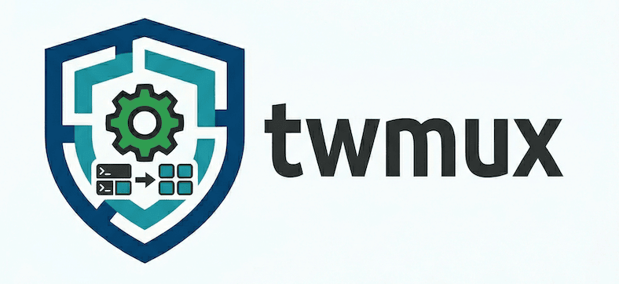

<p align="left">
  
</p>

Race-condition-safe **tmux** wrapper for coding agents.

## Features

- **Agent isolation** - Default socket `claude` keeps agent operations separate from user tmux
- **Safety boundaries** - Non-agent sockets require `--force` flag
- **Session lifecycle** - Create, monitor, and clean up sessions easily
- **Race-condition-safe send** - Verifies commands are received before sending Enter
- **Execute and capture** - Run commands and get output with exit codes
- **Marker-based execution** - Reliable output capture using unique markers
- **Wait-idle detection** - Wait until pane output stabilizes
- **JSON output** - Programmatic interface for all commands
- **Flexible targeting** - Pane IDs or session:window.pane syntax
- **Pane management** - Launch, kill, interrupt, and escape
- **Cross-session moves** - Move panes and windows between sessions

Nothing you couldn't do with bare "tmux" skill, but much more reliable with agent use.

## Agent Isolation

By default, twmux operates on the `claude` socket, keeping agent tmux sessions separate from your personal tmux:

```bash
# Agent operations (default socket: claude)
twmux new myapp
twmux send -t %0 "echo hello"
twmux status

# User can monitor without interference
tmux -L claude attach -t myapp   # Watch agent work
# Ctrl+b d to detach

# Access user's tmux requires explicit --force
twmux --force -L default status  # View user's default socket
```

Socket naming:
- `claude`, `claude-*` - Agent sockets (no `--force` needed)
- All other names - Require `--force` flag

## Installation

```bash
uv pip install -e .
```

## Usage

```bash
twmux [OPTIONS] COMMAND [ARGS]
```

### Global Options

| Option | Description |
|--------|-------------|
| `--json` | Output as JSON (for programmatic use) |
| `-L, --socket NAME` | tmux socket name (default: `claude`) |
| `--force` | Allow non-agent sockets (required for non-`claude*` sockets) |
| `-v, --verbose` | Verbose output |

## Commands

### send - Send text safely

Send text to a pane with race-condition-safe Enter handling.

```bash
twmux send -t %5 "echo hello"
twmux send -t main:0.1 "make test" --delay 0.1
twmux send -t %5 "partial text" --no-enter
```

### exec - Execute and capture

Execute a command and capture output with exit code.

```bash
twmux exec -t %5 "ls -la"
twmux --json exec -t main:0 "make test" --timeout 60
```

Returns:
- `output`: Command stdout/stderr
- `exit_code`: Command exit code (-1 if timeout)
- `timed_out`: Whether command timed out

### capture - Capture pane content

```bash
twmux capture -t %5
twmux capture -t %5 -n 50  # Last 50 lines
twmux --json capture -t main:0
```

### wait-idle - Wait for output stabilization

Wait until pane output stops changing.

```bash
twmux wait-idle -t %5
twmux wait-idle -t %5 --timeout 10 --interval 0.1
```

### interrupt - Send Ctrl+C

```bash
twmux interrupt -t %5
```

### escape - Send Escape key

```bash
twmux escape -t %5
```

### launch - Create new pane

Split current pane to create a new one.

```bash
twmux launch -t %5                      # Split below
twmux launch -t %5 -v                   # Split right (vertical)
twmux launch -t %5 -c "python3"         # Split and run command
```

### kill - Kill pane

```bash
twmux kill -t %5
```

### move-pane - Move pane to another session

Move a pane to another session, creating a new window or joining an existing one.

```bash
twmux move-pane -t %5 debug           # New window in "debug"
twmux move-pane -t %5 debug:0         # Join window 0 in "debug"
twmux --json move-pane -t %5 debug    # JSON output
```

Returns: `{"pane_id": "%5", "destination_session": "debug", "new_window": true}`

### move-window - Move window to another session

Move an entire window (with all panes) to another session.

```bash
twmux move-window -t build:0 debug       # Move window 0 of "build"
twmux move-window -t %5 debug            # Move window containing %5
twmux --json move-window -t build:0 debug # JSON output
```

Returns: `{"window_id": "@1", "window_index": "1", "pane_ids": ["%2", "%3"], "destination_session": "debug"}`

### new - Create session

Create a new tmux session on the agent socket. Prints monitor command for user observation.

```bash
twmux new myapp                    # Create session "myapp"
twmux new myapp -c "python3"       # Create and run command
twmux -L claude-isolated new test  # Use different agent socket
```

Output includes monitor command:
```
Session created: myapp on socket claude
Pane ID: %0

To monitor:  tmux -L claude attach -t myapp
To detach:   Ctrl+b d
```

### kill-session - Kill session

```bash
twmux kill-session myapp
```

### kill-server - Kill server

Kill the entire tmux server for a socket.

```bash
twmux kill-server                    # Kill default claude server
twmux -L claude-isolated kill-server # Kill specific socket
```

### status - Show tmux state

```bash
twmux status                # Show default socket (claude)
twmux status --all          # Show all agent sockets (claude*)
twmux --force status --all  # Show all sockets including user's
```

## Target Addressing

The `-t` option accepts tmux target syntax to identify panes.

### Pane ID (Recommended)

Direct pane reference using tmux pane ID:

```bash
twmux send -t %5 "echo hello"      # Pane ID %5
twmux exec -t %12 "ls"             # Pane ID %12
```

Get pane IDs with `twmux status` or `tmux list-panes -a`.

### Session:Window.Pane Format

Hierarchical addressing:

```bash
# Full path: session:window.pane
twmux send -t main:0.1 "echo hello"    # Session "main", window 0, pane 1
twmux send -t dev:2.0 "make test"      # Session "dev", window 2, pane 0

# Partial paths
twmux send -t main:0 "echo hello"      # Session "main", window 0, active pane
twmux send -t main: "echo hello"       # Session "main", active window/pane
twmux send -t :0.1 "echo hello"        # First session, window 0, pane 1
```

### Target Resolution

| Target | Meaning |
|--------|---------|
| `%5` | Pane with ID %5 (absolute) |
| `main:0.1` | Session "main", window 0, pane 1 |
| `main:0` | Session "main", window 0, active pane |
| `main:` | Session "main", active window and pane |
| `:0.1` | First session, window 0, pane 1 |
| `:0` | First session, window 0, active pane |
| (empty) | First session, active window and pane |

### Examples

```bash
# Start a REPL in a new pane and interact with it
twmux launch -t %5 -c "python3"
# Returns: {"pane_id": "%12"}

# Send commands to the new pane
twmux send -t %12 "print('hello')"
twmux wait-idle -t %12

# Capture output
twmux capture -t %12 -n 10

# Execute and get result
twmux --json exec -t %12 "print(1+1)"
# Returns: {"output": "2", "exit_code": 0, "timed_out": false}

# Clean up
twmux kill -t %12
```

## JSON Output

All commands support `--json` for programmatic use:

```bash
$ twmux --json exec -t %5 "echo hello"
{"output": "hello", "exit_code": 0, "timed_out": false}

$ twmux --json send -t %5 "test"
{"success": true, "attempts": 1}

$ twmux --json new myapp
{"session": "myapp", "socket": "claude", "pane_id": "%0", "monitor_cmd": "tmux -L claude attach -t myapp"}

$ twmux --json status
{
  "sockets": [
    {
      "socket": "claude",
      "sessions": [
        {
          "session_id": "$0",
          "session_name": "myapp",
          "windows": [...]
        }
      ]
    }
  ]
}
```

## How It Works

### Race-Condition-Safe Send

The `send` command:
1. Sends text without Enter
2. Waits (configurable delay)
3. Captures pane content
4. Sends Enter
5. Verifies content changed
6. Retries if needed

### Marker-Based Execution

The `exec` command:
1. Generates unique markers
2. Wraps command: `echo START; { cmd; } 2>&1; echo END:$?`
3. Polls pane with progressive expansion (100 → 500 → 2000 → all lines)
4. Parses output between markers
5. Extracts exit code

### Output Stabilization

The `wait-idle` command:
1. Hashes pane content (MD5)
2. Polls at configurable interval
3. Returns when N consecutive hashes match
4. Times out if content keeps changing

## Development

```bash
make install   # Install dependencies
make test      # Run tests
make lint      # Check code style
make format    # Auto-format code
make check     # Run lint + test
```

## License

MIT


### Prior Art, Inspiration
- [GitHub - pchalasani/claude-code-tools](https://github.com/pchalasani/claude-code-tools)
