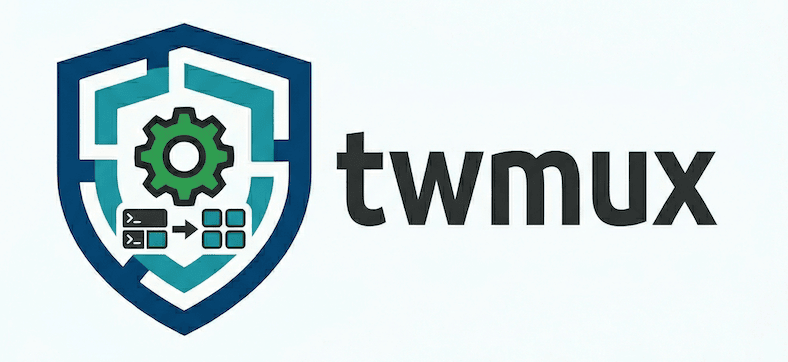

<p align="left">
  
</p>

Race-condition-safe **tmux** wrapper built for LLM coding agents — but equally pleasant for humans. Also ships with `twmux watch`: a small daemon + dashboard that surfaces every running coding agent across your tmux sessions, sorted by how long each one has been waiting on you.

## Why twmux?

LLM agents need to run shell commands, but raw tmux is fragile:
Enter keys get lost, output parsing breaks, errors produce tracebacks instead of structured data.
twmux solves this with race-condition-safe I/O, a consistent JSON contract, and agent-safe socket isolation.

**For agents:** Every command returns `{"ok": true, ...}` or `{"ok": false, "error": "..."}`. No tracebacks. No Rich markup in JSON. Predictable exit codes. Self-discoverable via `twmux --json`.

**For humans:** Rich-formatted output, helpful error messages, monitor commands for watching agent work. The `--json` flag is opt-in; without it, everything is human-friendly.

## Features

- **Structured JSON contract** - Consistent `{"ok": true/false, ...}` envelope for all commands, errors included
- **Agent isolation** - Default socket `claude` keeps agent operations separate from user tmux
- **Safety boundaries** - Non-agent sockets require `--force` flag
- **Race-condition-safe send** - Verifies commands are received before sending Enter
- **Execute and capture** - Run commands and get output with exit codes
- **Marker-based execution** - Reliable output capture using unique markers
- **Wait-idle detection** - Wait until pane output stabilizes
- **Self-discoverable** - `twmux --json` lists all commands; `twmux --json status` exposes all targets
- **Flexible targeting** - Pane IDs or session:window.pane syntax
- **Pane management** - Launch, kill, interrupt, move, and escape
- **Cross-session moves** - Move panes and windows between sessions
- **Zero tracebacks** - All errors are caught and formatted, even connection failures

Nothing you couldn't do with bare tmux, but much more reliable for agent use.

## Agent Isolation

By default, twmux operates on the `claude` socket, keeping agent tmux sessions separate from your personal tmux:

```bash
# Agent operations (default socket: claude)
twmux new myapp
twmux send -t %0 "echo hello"
twmux status

# User can monitor without interference
tmux -L claude attach -t myapp   # Watch agent work
# Ctrl+b d to detach

# Access user's tmux requires explicit --force
twmux --force -L default status  # View user's default socket
```

Socket naming:
- `claude`, `claude-*` - Agent sockets (no `--force` needed)
- All other names - Require `--force` flag

## Installation

```bash
uv pip install -e .
```

## Usage

```bash
twmux [OPTIONS] COMMAND [ARGS]
```

### Global Options

| Option | Description |
|--------|-------------|
| `--json` | Output as JSON (for programmatic use) |
| `-L, --socket NAME` | tmux socket name (default: `claude`) |
| `--force` | Allow non-agent sockets (required for non-`claude*` sockets) |
| `-v, --verbose` | Verbose output |

## Commands

### send - Send text safely

Send text to a pane with race-condition-safe Enter handling.

```bash
twmux send -t %5 "echo hello"
twmux send -t main:0.1 "make test" --delay 0.1
twmux send -t %5 "partial text" --no-enter
```

### exec - Execute and capture

Execute a command and capture output with exit code.

```bash
twmux exec -t %5 "ls -la"
twmux --json exec -t main:0 "make test" --timeout 60
```

Returns:
- `output`: Command stdout/stderr
- `exit_code`: Command exit code (-1 if timeout)
- `timed_out`: Whether command timed out

### capture - Capture pane content

```bash
twmux capture -t %5
twmux capture -t %5 -n 50  # Last 50 lines
twmux --json capture -t main:0
```

### wait-idle - Wait for output stabilization

Wait until pane output stops changing.

```bash
twmux wait-idle -t %5
twmux wait-idle -t %5 --timeout 10 --interval 0.1
```

### interrupt - Send Ctrl+C

```bash
twmux interrupt -t %5
```

### escape - Send Escape key

```bash
twmux escape -t %5
```

### launch - Create new pane

Split current pane to create a new one.

```bash
twmux launch -t %5                           # Split below
twmux launch -t %5 -v                        # Split right (vertical)
twmux launch -t %5 -c "python3"              # Split; type command into shell
twmux launch -t %5 --exec -c "nvim /tmp/x"   # Command IS pane process; pane dies on exit
twmux launch -t %5 --focus -c "python3"      # Split and move cursor to new pane
```

By default focus stays on the original pane (matches libtmux's detached split).
Use `--focus` to make the new pane active immediately.

With `--exec`, the command replaces the shell as the pane's PID 1. The pane
terminates automatically when the command exits — pair with `wait-pane` to
block until an editor or TUI is closed.

### kill - Kill pane

```bash
twmux kill -t %5
```

### wait-pane - Block until pane is gone

Polls the tmux server until the target pane no longer exists. Idempotent —
returns immediately if the pane is already gone.

```bash
twmux wait-pane -t %5                        # Wait forever
twmux wait-pane -t %5 --timeout 60           # Error after 60s if still alive
twmux wait-pane -t %5 --interval 0.1         # Poll every 100ms
```

Returns: `{"ok": true, "gone": true, "elapsed": 1.23}`. Exits 1 with
`{"ok": false, "error": "timeout after Ns"}` on timeout.

### move-pane - Move pane to another session

Move a pane to another session, creating a new window or joining an existing one.

```bash
twmux move-pane -t %5 debug           # New window in "debug"
twmux move-pane -t %5 debug:0         # Join window 0 in "debug"
twmux --json move-pane -t %5 debug    # JSON output
```

Returns: `{"ok": true, "pane_id": "%5", "destination_session": "debug", "new_window": true}`

### move-window - Move window to another session

Move an entire window (with all panes) to another session.

```bash
twmux move-window -t build:0 debug       # Move window 0 of "build"
twmux move-window -t %5 debug            # Move window containing %5
twmux --json move-window -t build:0 debug # JSON output
```

Returns: `{"ok": true, "window_id": "@1", "window_index": "1", "pane_ids": ["%2", "%3"], "destination_session": "debug"}`

### new - Create session

Create a new tmux session on the agent socket. Prints monitor command for user observation.

```bash
twmux new myapp                    # Create session "myapp"
twmux new myapp -c "python3"       # Create and run command
twmux -L claude-isolated new test  # Use different agent socket
```

Output includes monitor command:
```
Session created: myapp on socket claude
Pane ID: %0

To monitor:  tmux -L claude attach -t myapp
To detach:   Ctrl+b d
```

### kill-session - Kill session

```bash
twmux kill-session myapp
```

### kill-server - Kill server

Kill the entire tmux server for a socket.

```bash
twmux kill-server                    # Kill default claude server
twmux -L claude-isolated kill-server # Kill specific socket
```

### status - Show tmux state

```bash
twmux status                # Show default socket (claude)
twmux status --all          # Show all agent sockets (claude*)
twmux --force status --all  # Show all sockets including user's
```

## Target Addressing

The `-t` option accepts tmux target syntax to identify panes.

### Pane ID (Recommended)

Direct pane reference using tmux pane ID:

```bash
twmux send -t %5 "echo hello"      # Pane ID %5
twmux exec -t %12 "ls"             # Pane ID %12
```

Get pane IDs with `twmux status` or `tmux list-panes -a`.

### Session:Window.Pane Format

Hierarchical addressing:

```bash
# Full path: session:window.pane
twmux send -t main:0.1 "echo hello"    # Session "main", window 0, pane 1
twmux send -t dev:2.0 "make test"      # Session "dev", window 2, pane 0

# Partial paths
twmux send -t main:0 "echo hello"      # Session "main", window 0, active pane
twmux send -t main: "echo hello"       # Session "main", active window/pane
twmux send -t :0.1 "echo hello"        # First session, window 0, pane 1
```

### Target Resolution

| Target | Meaning |
|--------|---------|
| `%5` | Pane with ID %5 (absolute) |
| `main:0.1` | Session "main", window 0, pane 1 |
| `main:0` | Session "main", window 0, active pane |
| `main:` | Session "main", active window and pane |
| `:0.1` | First session, window 0, pane 1 |
| `:0` | First session, window 0, active pane |
| (empty) | First session, active window and pane |

### Examples

```bash
# Start a REPL in a new pane and interact with it
twmux launch -t %5 -c "python3"
# Returns: {"ok": true, "pane_id": "%12"}

# Send commands to the new pane
twmux send -t %12 "print('hello')"
twmux wait-idle -t %12

# Capture output
twmux capture -t %12 -n 10

# Execute and get result
twmux --json exec -t %12 "print(1+1)"
# Returns: {"ok": true, "output": "2", "exit_code": 0, "timed_out": false}

# Clean up
twmux kill -t %12
```

## JSON Output

All commands support `--json` for programmatic use. Every response follows a consistent envelope:

```
Success: {"ok": true,  ...command-specific-fields}
Error:   {"ok": false, "error": "human-readable message"}
```

Exit codes: `0` = success, `1` = any error. All JSON goes to stdout.

### Examples

```bash
$ twmux --json exec -t %5 "echo hello"
{"ok": true, "output": "hello", "exit_code": 0, "timed_out": false}

$ twmux --json send -t %5 "test"
{"ok": true, "success": true, "attempts": 1}

$ twmux --json send -t %999 "test"
{"ok": false, "error": "Pane not found: %999"}

$ twmux --json new myapp
{"ok": true, "session": "myapp", "socket": "claude", "pane_id": "%0", "monitor_cmd": "tmux -L claude attach -t myapp"}

$ twmux --json status
{
  "ok": true,
  "sockets": [
    {
      "socket": "claude",
      "sessions": [
        {
          "session_id": "$0",
          "session_name": "myapp",
          "windows": [...]
        }
      ]
    }
  ]
}
```

### Agent Self-Discovery

An agent encountering twmux for the first time can bootstrap itself:

```bash
# Discover available commands
$ twmux --json
{"ok": true, "commands": [{"name": "send", "description": "..."}, ...]}

# Discover available targets
$ twmux --json status
{"ok": true, "sockets": [{"sessions": [{"session_name": "myapp", "windows": [{"panes": [{"pane_id": "%0"}]}]}]}]}

# Use discovered target
$ twmux --json send -t %0 "echo hello"
{"ok": true, "success": true, "attempts": 1}
```

### Agent Integration Pattern

```python
import json, subprocess

def twmux(cmd: list[str]) -> dict:
    result = subprocess.run(
        ["twmux", "--json"] + cmd,
        capture_output=True, text=True,
    )
    response = json.loads(result.stdout)
    if not response["ok"]:
        raise RuntimeError(response["error"])
    return response

# One parser for all commands
twmux(["send", "-t", "%0", "make test"])
twmux(["wait-idle", "-t", "%0"])
output = twmux(["capture", "-t", "%0"])["content"]
```

## How It Works

### Race-Condition-Safe Send

The `send` command:
1. Sends text without Enter
2. Waits (configurable delay)
3. Captures pane content
4. Sends Enter
5. Verifies content changed
6. Retries if needed

### Marker-Based Execution

The `exec` command:
1. Generates unique markers
2. Wraps command: `echo START; { cmd; } 2>&1; echo END:$?`
3. Polls pane with progressive expansion (100 → 500 → 2000 → all lines)
4. Parses output between markers
5. Extracts exit code

### Output Stabilization

The `wait-idle` command:
1. Hashes pane content (MD5)
2. Polls at configurable interval
3. Returns when N consecutive hashes match
4. Times out if content keeps changing

## Python Library

twmux's value-added primitives — race-safe send, marker-based execution, and
idle detection — are importable directly from `twmux.lib.*`. Pair them with
`libtmux` for pane/session management; there is no separate wrapper API to
learn.

```python
import libtmux
from twmux.lib.safe_input import send_safe, wait_for_idle
from twmux.lib.execution import execute
from twmux.lib.safety import validate_socket

# Optional: enforce agent-socket policy (raises SocketValidationError)
validate_socket("claude", force=False)

server = libtmux.Server(socket_name="claude")
pane = server.sessions[0].active_window.active_pane

# Race-safe send: verifies pane content changed after Enter, retries on loss
result = send_safe(pane, "make test", enter=True)
assert result.success, f"lost Enter after {result.attempts} attempts"

# Marker-based execute: captures output + real exit code
res = execute(pane, "echo hello && false", timeout=10)
print(res.output)      # "hello"
print(res.exit_code)   # 1
print(res.timed_out)   # False

# Wait until the pane stops changing
wait_result = wait_for_idle(pane, poll_interval=0.2, stable_count=3, timeout=30)
```

### Public surface

| Module | Exports |
|--------|---------|
| `twmux.lib.safe_input` | `send_safe(pane, text, enter=True, enter_delay=0.05) -> SendResult`, `wait_for_idle(pane, poll_interval=0.2, stable_count=3, timeout=30.0) -> WaitResult` |
| `twmux.lib.execution` | `execute(pane, cmd, timeout=30.0, poll_interval=0.2) -> ExecResult`, `ExecResult(output, exit_code, timed_out)` |
| `twmux.lib.safety` | `validate_socket(socket_name, force)`, `is_agent_socket(socket_name)`, `enumerate_agent_sockets()`, `SocketValidationError` |

### What about launch / kill / status / move-pane?

These are thin wrappers over libtmux — call libtmux directly:

```python
# Instead of `twmux launch`:
new_pane = pane.split(shell="python3")          # --exec equivalent
new_pane = pane.split()                          # plain split
new_pane.select()                                # --focus equivalent

# Instead of `twmux kill`, `twmux status`:
pane.kill()
[p.pane_id for p in server.panes]
```

The CLI exists for the JSON envelope and agent-subprocess orchestration — if
you're already in Python, libtmux is the API for those operations.

## `twmux watch` — multi-agent dashboard & switcher

When you run several coding agents in parallel — across multiple tmux sessions,
windows, and panes — it's easy to lose track of which ones are blocked on a
permission prompt, which are still working, and which finished hours ago
without you noticing. `twmux watch` solves this with one small daemon and one
tmux switcher.

### How it works

1. `twmux watch daemon` runs as a background process started by tmux.
2. Every `poll_interval` seconds it enumerates every pane on every tmux socket
   via libtmux, captures the visible pane content, and classifies the state
   per the regex rules in `~/.config/twmux/agents.toml`:
   - **wait** — agent is blocked on user input
   - **working** — agent is actively processing
   - **idle** — agent is at its prompt, nothing happening
3. State and waiting-time are written, sorted, to
   `~/.cache/twmux/agents.tsv`.
4. An fzf-based tmux switcher (see below) reads the TSV — its list is the
   dashboard, its preview pane shows the live agent output, and Enter jumps
   you to the corresponding pane.

### Setup

```bash
# Install / upgrade twmux
uv tool install --upgrade twmux

# Copy the example config and tune the regexes to your agents
mkdir -p ~/.config/twmux
cp examples/agents.toml ~/.config/twmux/agents.toml
$EDITOR ~/.config/twmux/agents.toml

# Switcher script (matches the existing ~/.config/tmux/tmux-* pattern)
cp examples/tmux-agent-switcher ~/.config/tmux/
chmod +x ~/.config/tmux/tmux-agent-switcher

# In ~/.config/tmux/tmux.conf
bind-key a display-popup -h 80% -w 90% -E "~/.config/tmux/tmux-agent-switcher"
```

Pick a daemon-startup method — see "Daemon lifecycle" below.

### Daemon lifecycle — two ways to start

Both methods rely on `--ensure-running`, which makes startup idempotent via a
PID file at `~/.cache/twmux/watch.pid`. Pick **one**; running both is harmless
(the second one exits silently) but creates noise in logs.

| | tmux `run-shell` | launchd agent |
| --- | --- | --- |
| Lifecycle | Tied to tmux server | Tied to user login |
| Survives `tmux kill-server` | No | Yes |
| Runs without tmux | No | Yes (but has nothing to poll) |
| Auto-restart on crash | Tmux re-runs on next start | KeepAlive throttled at 10s |
| Logs | `~/.cache/twmux/watch.log` (rotated, max ~4 MB) | `~/.cache/twmux/watch.log` (rotated, max ~4 MB) |
| Install effort | One line | Plist + `launchctl load` |

#### Option A — tmux `run-shell` (simpler)

One-time install: add this line near the bottom of `~/.config/tmux/tmux.conf`,
then `tmux source-file ~/.config/tmux/tmux.conf`:

```tmux
run-shell -b 'twmux watch daemon --ensure-running'
```

The `-b` is mandatory — without it tmux blocks on the daemon's never-ending
poll loop and freezes on startup. `--ensure-running` is also mandatory so
that `source-file` reloads don't spawn duplicates.

#### Option B — launchd agent (macOS-native)

One-time install:

```bash
sed "s|USERNAME|$USER|g" examples/dev.sysid.twmux-watch.plist \
  > ~/Library/LaunchAgents/dev.sysid.twmux-watch.plist

launchctl bootstrap gui/$(id -u) ~/Library/LaunchAgents/dev.sysid.twmux-watch.plist
```

> **Why `bootstrap` and not `load`?** Legacy `launchctl load` is brittle on
> modern macOS — if a previous load registered the same label, retrying gives
> the unhelpful `Load failed: 5: Input/output error`. `bootstrap` is the
> documented modern API and gives clear domain errors when something is wrong.

To uninstall (after `launchctl bootout`, see "Operating the daemon" below):

```bash
rm ~/Library/LaunchAgents/dev.sysid.twmux-watch.plist
```

If `twmux` lives somewhere other than `~/.local/bin` (e.g. Homebrew at
`/opt/homebrew/bin`), edit `ProgramArguments[0]` and the `PATH` value in the
plist before loading. Run `which twmux` to find your install path.

### Operating the daemon

`agents.toml` is **read once at startup** — there's no hot reload. After
editing the config you have to restart. Here's the full operational matrix:

For brevity below, set `LABEL=dev.sysid.twmux-watch`. The launchd domain for
agents in `~/Library/LaunchAgents/` is **`gui/$(id -u)`** (the user's GUI
session), not `user/$(id -u)` (which is reserved for headless contexts).

| Action | Option A (tmux run-shell) | Option B (launchd) |
| --- | --- | --- |
| **Start** | `twmux watch daemon --ensure-running &` | `launchctl bootstrap gui/$(id -u) ~/Library/LaunchAgents/$LABEL.plist` |
| **Stop** | `twmux watch stop` | `launchctl bootout gui/$(id -u)/$LABEL` |
| **Restart** | `twmux watch stop && twmux watch daemon --ensure-running &` | `launchctl kickstart -k gui/$(id -u)/$LABEL` |
| **Is it running?** | `twmux watch status` (output ⇒ yes) or `pgrep -f 'twmux watch daemon'` | `launchctl list \| grep $LABEL`<br>(first column is PID; `-` means registered-but-not-running) |
| **Tail logs** | `tail -F ~/.cache/twmux/watch.log` | same |
| **Inspect current TSV** | `cat ~/.cache/twmux/agents.tsv` | same |

Notes:

- `twmux watch stop` is **idempotent** — exits 0 with "no daemon running" if
  the PID file is missing or points at a dead process. Safe to chain in
  scripts.
- `twmux watch stop` also works under Option B, but `launchctl bootout` is
  preferred there: it stops the daemon **and** removes the registration so
  `KeepAlive` cannot relaunch it. Plain `stop` would let launchd respawn it
  within `ThrottleInterval` (10s).
- `kickstart -k` is the only reliable restart for Option B — it kills the
  current invocation and re-runs the program defined in the plist without
  needing to unload/reload.
- The PID file at `~/.cache/twmux/watch.pid` is removed on graceful exit
  (SIGTERM or Ctrl-C). A stale PID file from a crash is auto-detected and
  cleaned on the next `--ensure-running` invocation.
- Logs rotate via Python's `RotatingFileHandler`: 1 MB × 4 files = **~4 MB
  ceiling** regardless of crash-loop noise (`watch.log`, `watch.log.1..3`).

### `agents.toml`

```toml
poll_interval = 2.0   # seconds

[claude_code]
# CC's pane_current_command is its version string (e.g. "2.1.139") — use
# the tmux pane title instead. It starts with "✳ " when idle, and with a
# braille-block spinner glyph (U+2800–U+28FF, e.g. "⠐ ") while processing.
title_match = "^[✳⠀-⣿] "
# Idle: CC's prompt is "❯" followed by NBSP (\xc2\xa0), not ASCII space.
re_idle     = "^❯"
re_wait     = "Do you want to proceed|Do you trust|❯ 1\\."
re_working  = "esc to interrupt"

[aider]
cmd_match = "aider"
re_wait   = "^\\? "
re_idle   = "^> "
```

A pane matches an agent if **either** `cmd_match` hits its current command
**or** `title_match` hits its tmux pane title. First-match wins.

Add a new agent by appending a section; no code changes needed.

### Commands

```bash
twmux watch daemon                   # foreground poll loop (Ctrl-C to stop)
twmux watch daemon --ensure-running  # exit silently if a daemon is running
twmux watch stop                     # SIGTERM the running daemon, wait for exit
twmux watch status                   # one-shot TSV dump for debugging
```

See **Operating the daemon** above for the full start/stop/restart matrix
covering both `tmux run-shell` and `launchctl`.

## Development

```bash
make install   # Install dependencies
make test      # Run tests
make lint      # Check code style
make format    # Auto-format code
make check     # Run lint + test
```

### Iterating on `twmux watch` (or any installed entry point)

Default `uv tool install` builds and caches a wheel keyed on
`(name, version)` — editing source and reinstalling at the **same version**
won't pick up your changes unless you bump `version` in `pyproject.toml` or
fight the cache with `uv tool uninstall && uv cache clean twmux && uv tool
install`. Plus, a running `launchctl`-managed daemon holds the old binary in
memory until you kickstart it.

The clean workflow is an editable install — `~/.local/bin/twmux` becomes a
stub that imports directly from the source tree, and process restarts pick
up source changes without rebuild:

```bash
uv tool install --editable /Users/$USER/dev/s/private/twmux
```

You only do this once. From then on the cycle is wrapped by Make targets that
auto-detect launchd vs. plain `twmux watch`:

```bash
make watch-restart   # kickstart under launchd, stop+start otherwise
make watch-status    # process + launchd registration + pid file + TSV row count
make watch-logs      # tail -F ~/.cache/twmux/watch.log
make watch-start     # one-shot (no restart logic)
make watch-stop      # bootout under launchd, SIGTERM otherwise
```

Inner loop:

1. Edit source under `src/twmux/`.
2. `make test` (logic tests, no daemon needed).
3. `make watch-restart` to swap the running daemon to the new code.
4. `make watch-logs` in another pane to see the new `daemon started` line and
   any poll exceptions that hit the rotating handler.

To confirm the install is editable (one-time sanity check):

```bash
# Should print a path inside your source tree, NOT inside ~/.local/share/uv/.
/Users/$USER/.local/share/uv/tools/twmux/bin/python -c \
  "import twmux; print(twmux.__file__)"
```

Caveats:

- **Dependency changes** still require a reinstall. If you bump a dep in
  `pyproject.toml`, run `uv tool install --editable --reinstall …` to refresh
  the tool's isolated venv.
- **Same Python process keeps old code in memory** — Python imports are
  cached per process. Editable means source edits are visible *on next
  process start*, not in an already-running daemon. The kickstart in step 3
  is what makes the new code go live.

## License

MIT


### Prior Art, Inspiration
- [GitHub - pchalasani/claude-code-tools](https://github.com/pchalasani/claude-code-tools)
